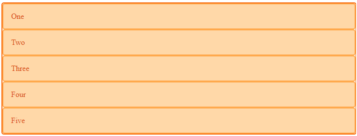

# Módulo 11 - Fundamentos do CSS responsivo

## Grid ou Flexbox?

- Grid é bidimensional, trabalha com linhas e colunas.
- Flexbox é unidirecional, trabalha com a linha ou com a coluna.
- Grid e flexbox se complementam.

## Resumo

Quando aplicamos a propriedade CSS `display: grid;` em um elemento, como uma `<div>`, por exemplo, esse elemento se torna um *grid container*.
Todo elemento que for inserido dentro desse *grid container*, ou seja, seus filhos diretos, se tornam *grid items* e seu comportamento é similar a um `display: block`.

```HTML
<div class="wrapper">
  <div>One</div>
  <div>Two</div>
  <div>Three</div>
  <div>Four</div>
  <div>Five</div>
</div>
```

```CSS
.wrapper {
  display: grid;
}
```



## Grid Tracks

Definimos linhas e colunas no grid com as propriedades `grid-template-columns` e `grid-template-rows`. Isso define o *grid tracks*.
O *grid track* se refere ao espaço entre duas linhas ou colunas definidas no grid. Quando você cria um layout com Grid, você define linhas e colunas para estruturar o conteúdo da página. Essas linhas e colunas dividem a área de layout em grades menores. O espaço entre cada uma dessas grades é chamado de "grid track".

## Propriedades

### Unidades

Nas propriedades de grid podem ser utilizadas quaisquer unidades de medida. Para nos ajudar a criar layouts flexíveis utilizando o grid, foi criada a `fr` que representa uma fração do espaço disponível no container do grid.

### Colunas e Linhas

- `grid-template-columns: <unidade> <unidade> <unidade>` - Define o número de colunas do layout grid
- `grid-template-rows: <unidade> <unidade> <unidade>` - Define o número de linhas do layout grid
- `grid-column-start: <numero_linhaImaginaria_inicio>` - Define a partir de qual coluna o gride começa
- `grid-column-end: <numero_linhaImaginaria_fim>` - Define em qual coluna o grid termina
- `grid-column: <start>/<end>` - Shorthand.
- `grid-row-start: <numero_linhaImaginaria_inicio>` - Define a partir de qual coluna o gride começa
- `grid-row-end: <numero_linhaImaginaria_fim>` - Define em qual coluna o grid termina
- `grid-row: <start>/<end>` - Shorthand.

### Areas

- `grid-area: 'nome_da_area';` - Define um nome a ser utilizado para preencher *grids tracks* definidos nas propriedades `grid-template-columns` e `grid-template-rows`.
- `grid-template-areas` - Define o posicionamento onde cada *grid area* irá ocupar, conforme definido nas `grid-template-columns`, `grid-template-rows` e `grid-area`.

### Alinhamento

- `align-content: <valor>` - Alinha o conteúdo de um container na vertical
- `justify-content: <valor>` - Alinha o conteúdo de um container na horizontal
- `place-content: <valor>` - Alinha o conteúdo de um container na vertical e horizontal
- `align-item: <valor>` - Alinha cada elemento dentro do container na vertical
- `justify-item: <valor>` - Alinha cada elemento dentro do container na horizontal
- `place-item: <valor>` - Alinha cada elemento dentro do container na vertical e horizontal
- `align-self: <valor>` - alinha o elemento em si na vertical
- `justify-self: <valor>` - alinha o elemento em si na horizontal
- `place-self: <valor>` - alinha o elemento em si na vertical e horizontal

#### Exemplo

No exemplo abaixo será mostrado um grid layout onde foi definido 3 linhas e colunas, onde o cabeçalho ocupará todas as 3 colunas e 1 linha, o aside ira ocupar 1 coluna e 1 linha, o main irá ocupar 2 colunas e 1 linha e o footer ocupará 3 colunas e 1 linha.

```HTML
<body class="container">
    <header>
        header
    </header>
    <aside>
        aside
    </aside>
    <main>
        main
    </main>
    <footer>
        footer
    </footer>
</body>
```

```CSS
.container {
    display: grid;
    grid-template-columns: 1fr 1fr 1fr;
    grid-template-rows: 20% 1fr 10%;

    grid-template-areas: 
        'header header header'
        'aside main main'
        'footer footer footer'
        ;

    header {
        grid-area: header;
    }

    aside {
        grid-area: aside;
    }

    main {
        grid-area: main;
    }

    footer {
        grid-area: footer;
    }
}
```
